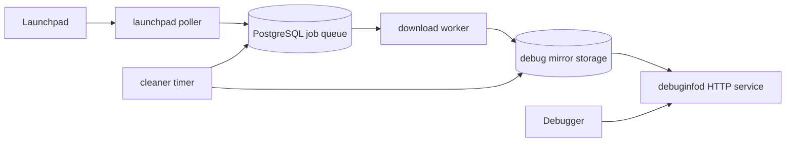

# ubuntu-debuginfod-operator

**ubuntu-debuginfod-operator** is a machine [charm](https://juju.is/charms-architecture) that deploys [ubuntu-debuginfod](https://launchpad.net/ubuntu-debuginfod).

`ubuntu-debuginfod` is a wrapper around `debuginfod`, which provides debugging symbols of Ubuntu archive packages to compatible debuggers.
Debuggers use this server to automatically fetch the debug symbols as needed during a debugging session.
It polls Launchpad periodically and retrieves all publications for the Ubuntu archive, and specified PPAs.
The publications are downloaded into a directory so `debuginfod` can serve them to debuggers.

## Architecture

The ubuntu-debuginfod-operator is designed the following way:





## Getting started

Deploy the ubuntu-debuginfod server using `juju deploy ubuntu-debuginfod`.
You will need storage of at least 10TiB storage in `/srv/debug-mirror` (all binary and source publications of the archive).

To allow Launchpad interaction, you need to set the `lp_credentials` option to a secret which provides the launchpadlib credentials file.
You can do this the following way:

``` console
runuser -u mirror -- ubuntu-debuginfod login /tmp/lp.cred
juju add-secret debuginfod-launchpad cred#file=/tmp/lp.cred
juju grant-secret debuginfod-launchpad $your_application
juju secrets  # get the secret id
juju config $your_application lp_credentials=secret:$secret_id"
```

The charm installs PostgreSQL on the unit, creates the `mirror` login role and `ubuntu-debuginfod` database, and applies schema migrations before starting workers.
It stores PPA configuration in `/home/mirror/.config/ubuntu-debuginfod/config.toml`; the default database URL is intentionally omitted so PostgreSQL peer authentication uses the local socket.
Set `downloader_workers` to control how many parallel download workers run on the unit; it defaults to `1`.
Worker counts are currently configured independently per unit rather than coordinated across an application.

To activate the archive synchronization, set option `update_ddeb=true`.

## Contributing

Please see the [Juju SDK docs](https://juju.is/docs/sdk) for guidelines on enhancements to this charm following best practice guidelines, and [contributing.md](./contributing.md) for developer guidance.

## License

ubuntu-debuginfod-operator is free software, distributed under the GNU GPLv3. See [LICENSE](../LICENSE) for more information.
